# Islami App

A comprehensive Islamic application built with Flutter, designed to provide users with essential religious tools and content including Quran recitations, prayer times, radio, and Azkar.

## Features

- **Prayer Times**: Real-time prayer timings based on location, featuring a countdown to the next prayer and Hijri/Gregorian dates.
- **Quran Radio & Reciters**:
    - Stream various Quranic radio stations.
    - Browse and listen to famous reciters.
    - **Smart Playback**: Automatically plays the next Surah and allows manual navigation (Next/Previous).
- **Azkar & Duas**: Categorized Azkar (Morning, Evening, Sleeping, etc.) with detailed views.
- **Hadith**: Access to a collection of Hadiths.
- **Sebha**: Digital tasbih for dhikr.
- **Qibla Finder**: 
    - Real-time compass to find the Qibla direction.
    - **Visual Feedback**: The needle and border turn green when correctly aligned.
    - **Haptic Feedback**: The device vibrates upon successful alignment.
    - **Calibration Support**: Detection of unreliable sensor states with a guiding calibration GIF.
- **Modern UI/UX**:
    - Responsive design for different screen sizes.
    - **Skeleton Loading**: Smooth shimmer effects instead of traditional loaders for a better user experience.
    - Elegant gold and dark theme inspired by Islamic art.
- **Onboarding**: A dedicated introduction screen for first-time users.

## Demo

<p align="center">
  <a href="https://drive.google.com/file/d/1M4OqAwqub0mT2yTIHYiZbwQIu_NaGtLT/view?usp=drive_link"><b>🎥 View Demo Video</b></a>
</p>

<p align="center">
  <video src="screenshots/demo.mp4" type="video/mp4" width="400" controls>
    Your browser does not support the video tag.
  </video>
</p>

## Screenshots

Explore the app's elegant interface and core functionalities through these visuals.

<p align="center">
  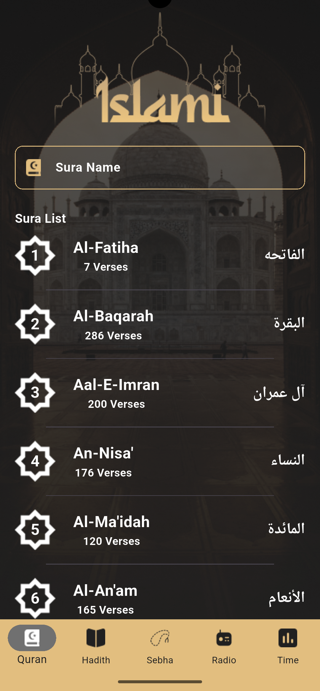
  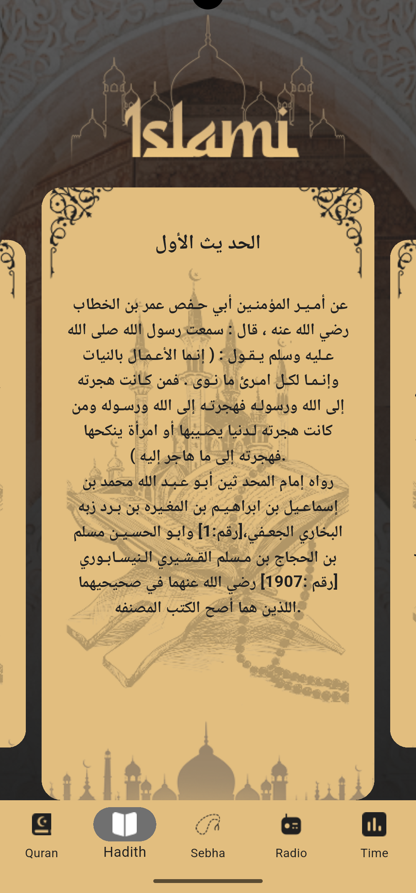
  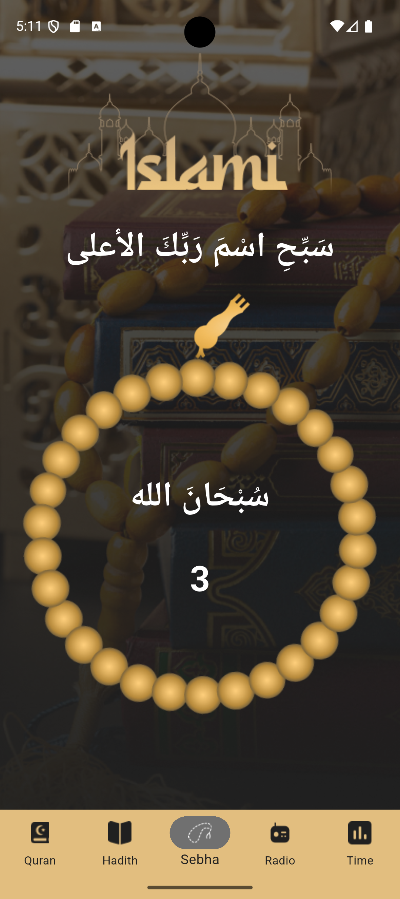
  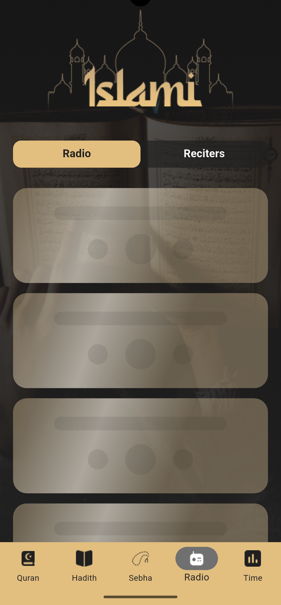
  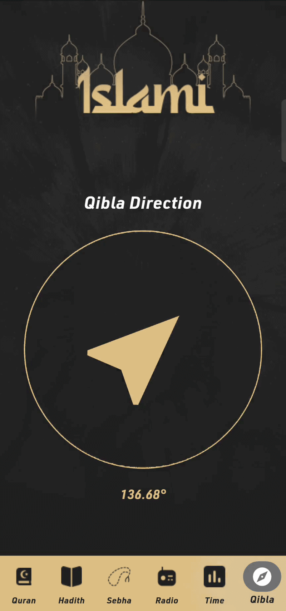
</p>
<p align="center">
  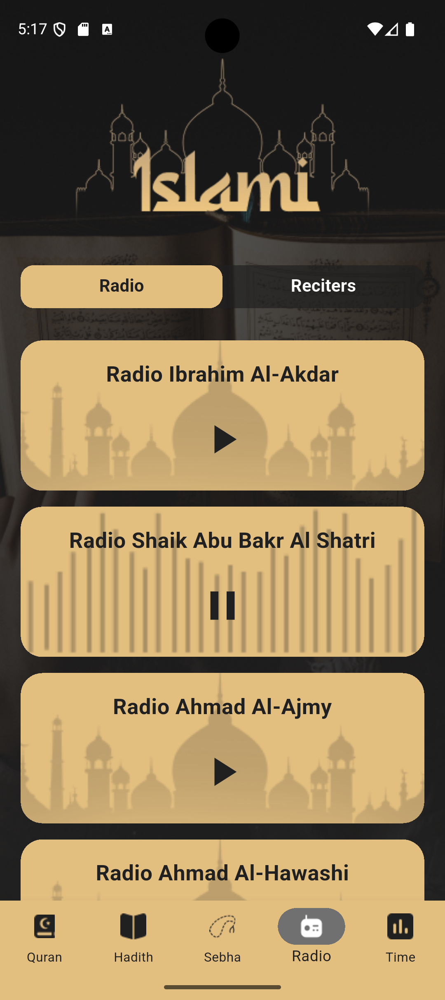
  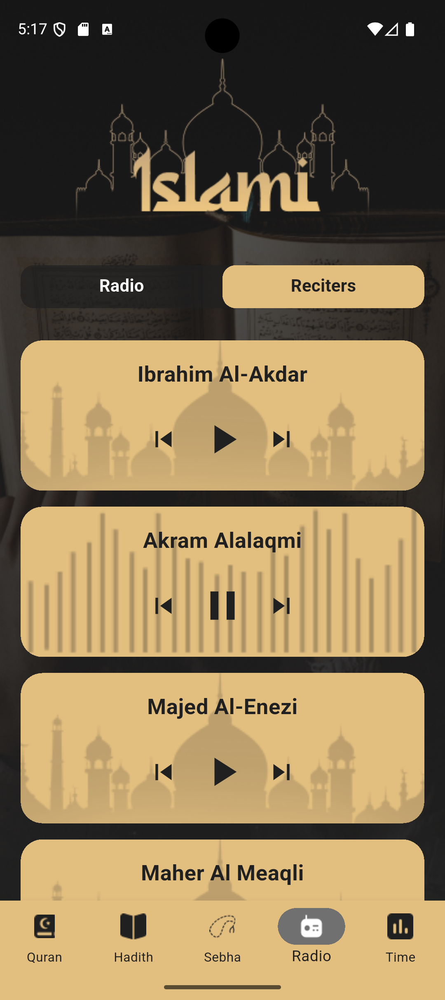
  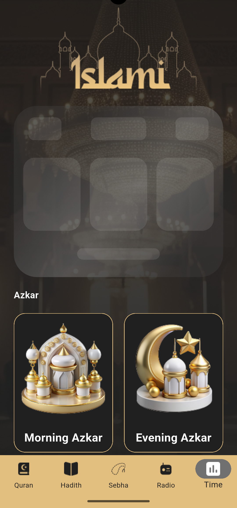
</p>
<p align="center">
  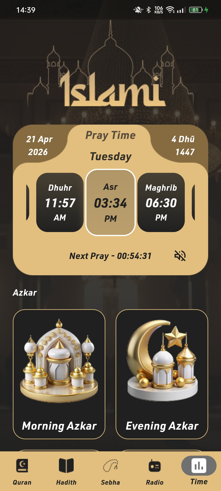
  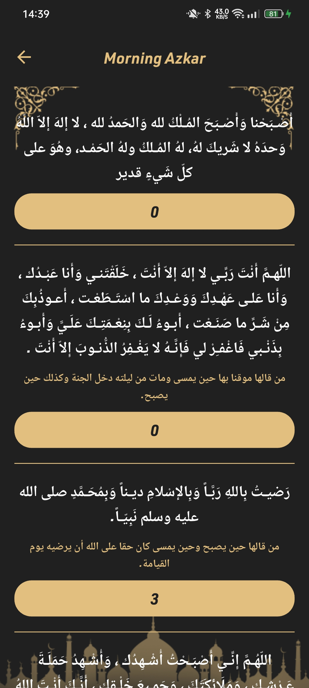
  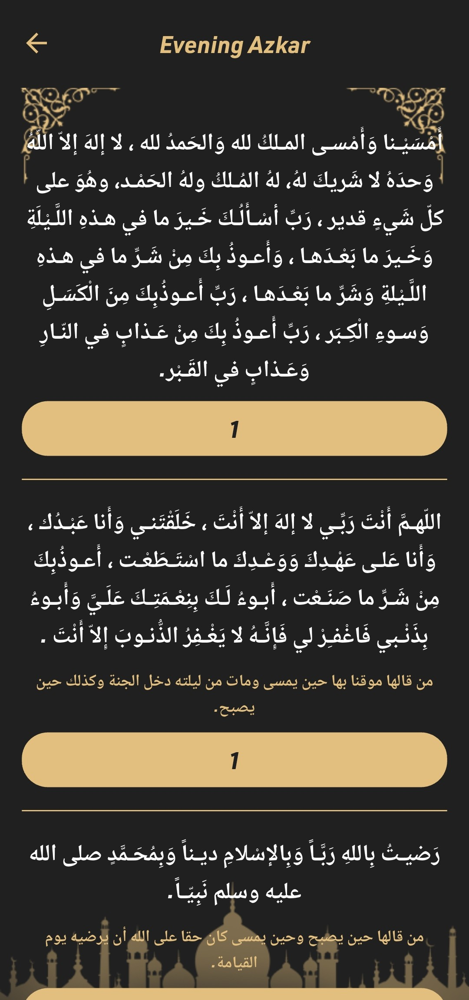
</p>
<p align="center">
  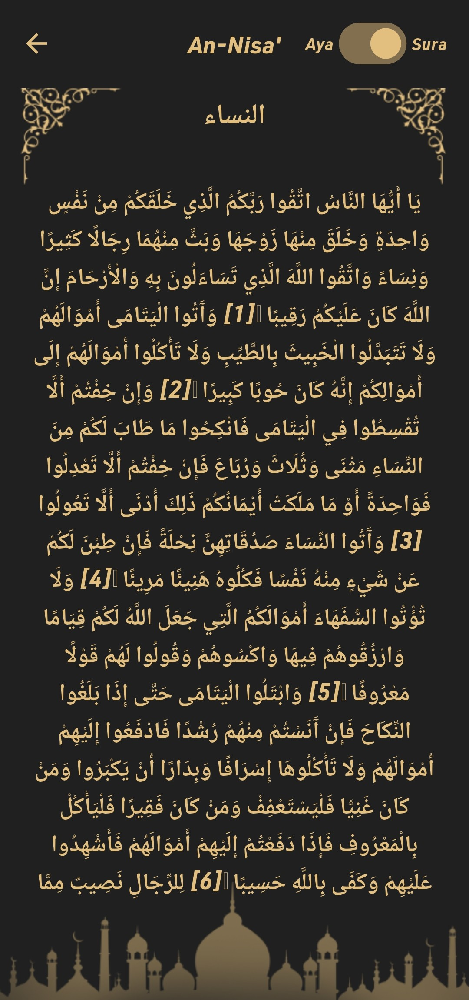
  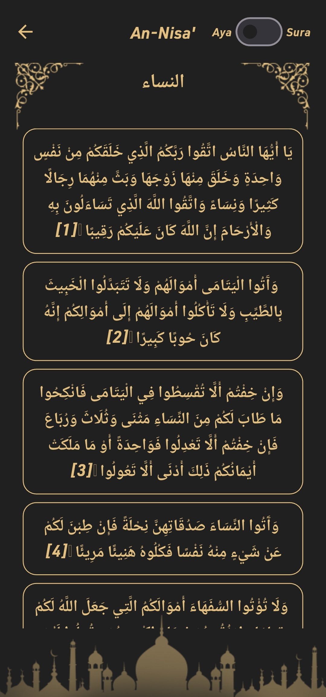
  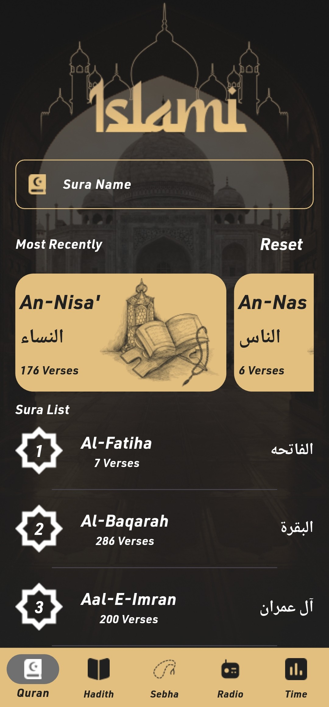
  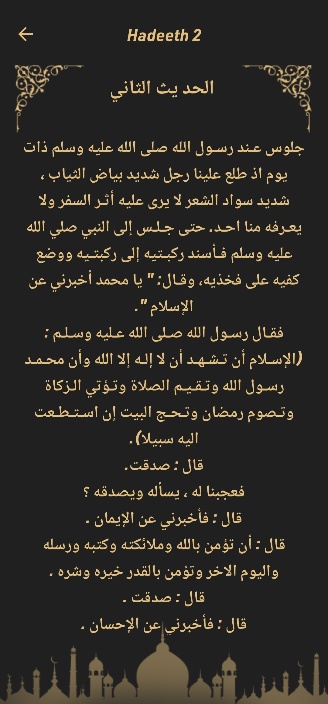
</p>

## Main Dependencies

- **Framework**: [Flutter](https://flutter.dev/)
- **State Management**: [flutter_bloc](https://pub.dev/packages/flutter_bloc) & [provider](https://pub.dev/packages/provider)
- **Networking**: [dio](https://pub.dev/packages/dio), [retrofit](https://pub.dev/packages/retrofit) & [pretty_dio_logger](https://pub.dev/packages/pretty_dio_logger)
- **Audio Playback**: [just_audio](https://pub.dev/packages/just_audio)
- **Location & Compass**: [geolocator](https://pub.dev/packages/geolocator) & [flutter_qiblah](https://pub.dev/packages/flutter_qiblah)
- **UI Components**: [carousel_slider](https://pub.dev/packages/carousel_slider) & [introduction_screen](https://pub.dev/packages/introduction_screen)
- **Local Storage**: [shared_preferences](https://pub.dev/packages/shared_preferences)
- **Utilities**: [intl](https://pub.dev/packages/intl), [json_annotation](https://pub.dev/packages/json_annotation), [flutter_native_splash](https://pub.dev/packages/flutter_native_splash)

## Getting Started

### Prerequisites

- Flutter SDK
- Android Studio / VS Code
- Dart SDK

### Installation

1. Clone the repository:
   ```bash
   git clone https://github.com/your-username/islami.git
   ```
2. Navigate to the project directory:
   ```bash
   cd islami
   ```
3. Install dependencies:
   ```bash
   flutter pub get
   ```
4. Run the build runner to generate necessary files (Retrofit/JsonSerializable):
   ```bash
   flutter pub run build_runner build
   ```
5. Run the application:
   ```bash
   flutter run
   ```

## Project Structure

```text
lib/
├── api/          # API managers and services
├── model/        # Data models and responses
├── pages/        # UI Screens and Tabs
│   └── tabs/     # Radio, Time, Quran, etc.
├── utils/        # App constants, colors, fonts, and helpers
└── widgets/      # Reusable UI components
```

## License

This project is licensed under the MIT License - see the [LICENSE](LICENSE) file for details.
